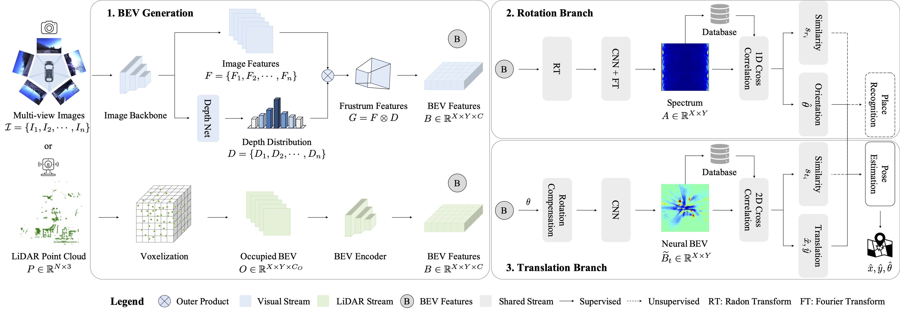

# RING#: PR-by-PE Global Localization with Roto-translation Equivariant Gram Learning

[](https://arxiv.org/abs/2409.00206)
[](https://ieeexplore.ieee.org/document/10891747)
[](https://www.bilibili.com/video/BV1Y92dYTE5b)
[](LICENSE)

**Paper:** Sha Lu, Xuecheng Xu, Dongkun Zhang, Yuxuan Wu, Haojian Lu, Xieyuanli Chen, Rong Xiong, and Yue Wang, "RING#: PR-by-PE Global Localization with Roto-translation Equivariant Gram Learning", *_IEEE Transactions on Robotics (TRO)_*, 2025.

**Maintainer:** [Sha Lu](https://lus6-jenny.github.io/), [lusha@zju.edu.cn](mailto:lusha@zju.edu.cn)

## 📌 Table of Contents
- [Introduction](#introduction)
- [Key Features](#key-features)
- [Prerequisites](#prerequisites)
- [Installation](#installation)
- [Data Preparation](#data-preparation)
- [Training](#training)
- [Evaluation](#evaluation)
- [Citation](#citation)
- [Acknowledgments](#acknowledgments)
- [License](#license)

## 🌍 Introduction <a name="introduction"></a>
**RING#** is an **end-to-end**, **PR-by-PE** (Place Recognition by Pose Estimation) global localization framework that operates on **BEV** (Bird's Eye View) features **compatible with both vision and LiDAR sensors**. RING# incorporates a novel design that learns two **equivariant representations** from BEV features, enabling **globally convergent** and **computationally efficient** pose estimation. Comprehensive experiments on the NCLT and Oxford datasets show that RING# outperforms state-of-the-art methods in both vision and LiDAR modalities, validating the effectiveness of the proposed approach.



## ⚡ Key Features <a name="key-features"></a>
- **End-to-End Framework**: RING# is designed to be an end-to-end framework, allowing for seamless integration of all components.
- **PR-by-PE Localization**: Derives place recognition similarity directly from correlation-based pose estimation, reducing error accumulation compared to traditional PR-then-PE localization methods.
- **Vision and LiDAR Compatibility**: Supports both vision and LiDAR inputs by operating on BEV features, making it versatile for various robotic applications.
- **Global Convergence**: Learns equivariant representations that handle pose transformations (x, y, θ), ensuring convergence to the optimal solution without initialization.
- **Computational Efficiency**: Decouples pose estimation into rotation and translation, accelerated by Fast Fourier Transform (FFT) and GPU batch processing, enabling fast matching.

## 🛠️ Prerequisites <a name="prerequisites"></a>
- [miniconda](https://docs.conda.io/projects/miniconda/en/latest/index.html) or [anaconda](https://www.anaconda.com/products/distribution)
- [CUDA](https://developer.nvidia.com/cuda-downloads) (We have tested with CUDA 11.3 and 11.6)

## 🚀 Installation <a name="installation"></a>
1. Create a virtual environment:
    ```bash
    conda create -n ringsharp python=3.8
    conda activate ringsharp
    ```

2. Clone the repository and install core dependencies:

    It's highly recommended to use the exact versions specified in `requirements.txt` to ensure reproducibility.
    ```bash
    git clone https://github.com/lus6-Jenny/RINGSharp.git
    cd RINGSharp
    pip install -r requirements.txt
    ```
    *Note: If you encounter issues, check compatibility with your CUDA and PyTorch versions.*

3. Install external dependencies from source:

    Some components ([fast_gicp](https://github.com/SMRT-AIST/fast_gicp), [torch-radon](https://github.com/matteo-ronchetti/torch-radon)) require manual compilation:
    ```bash
    # Install fast_gicp (if needed for point cloud registration)
    git clone https://github.com/SMRT-AIST/fast_gicp.git --recursive
    cd fast_gicp
    python setup.py install --user

    # Install torch-radon (required for RING#)
    git clone https://github.com/matteo-ronchetti/torch-radon.git -b v2
    cd torch-radon
    python setup.py install
    ```

4. Install the package:
    ```bash
    # Install custom CUDA ops for glnet
    cd glnet/ops
    python setup.py develop

    # Install the main glnet package
    cd ../..
    python setup.py develop
    ```

## 📂 Data Preparation <a name="data-preparation"></a>
1.  Download datasets:
    - [NCLT Dataset](https://robots.engin.umich.edu/nclt/)
    - [Oxford Radar Robotcar Dataset](https://oxford-robotics-institute.github.io/radar-robotcar-dataset/)
    
    Organize the downloaded data into directories. Example structure:
    ```
    ~/Data/
    ├── NCLT/
    │   ├── yyyy-mm-dd/ (e.g., 2012-01-08)
    │   │   ├── velodyne_sync/ (Velodyne data)
    │   │   │   ├── xxxxxx.bin
    │   │   │   ├── ...
    │   │   ├── ground_truth/ (Ground truth data) 
    │   │   │   ├── groundtruth_yyyy-mm-dd.csv (e.g., groundtruth_2012-01-08.csv)
    │   │   ├── lb3/ (Ladybug camera data)
    │   │   │   ├── Cam0/
    │   │   │   ├── Cam1/
    │   │   │   ├── Cam2/
    │   │   │   ├── Cam3/
    │   │   │   ├── Cam4/
    │   │   │   ├── Cam5/
    │   │   ├── cam_param/ (Camera parameters)
    │   │   ├── U2D/ (Distortion parameters)
    │   │   └── ...
    │   └── ...
    └── Oxford_radar/
        ├── yyyy-mm-dd-hh-mm-ss/ (e.g., 2019-01-11-13-24-51)
        │   ├── velodyne_left/ (Left Velodyne data)
        │   │   ├── xxxxxx.bin
        │   │   ├── ...
        │   ├── velodyne_right/ (Right Velodyne data)
        │   │   ├── xxxxxx.bin
        │   │   ├── ...
        │   ├── gps.csv
        │   ├── ins.csv
        │   ├── mono_left/
        │   ├── mono_rear/
        │   ├── mono_right/
        │   ├── stereo/
        │   │   ├── centre/
        ├── models/ (Camera parameters)
        │   └── ...
        ├── extrinsics/ (Extrinsic parameters)
        │   └── ...
        └── ...
    ```
    *(Note: Adjust paths in config files according to your storage location)*

2. Preprocess images:
   
   For image data, you need to first preprocess the images (undistort, rectify, crop, resize, etc.) and save them in the appropriate format:
   ```bash
   # ------ NCLT Dataset ------
   cd glnet/datasets/nclt
   python image_preprocess.py # The generated images will be saved in the 'lb3_u_s_384/Cam{0,1,2,3,4,5}' directories in jpg format

   # ------ Oxford Radar Dataset ------
   cd glnet/datasets/oxford
   python image_preprocess.py # The generated images will be saved in the 'mono_left_rect', 'mono_rear_rect', 'mono_right_rect', 'stereo/centre_rect' directories in png format
   ```

3. Generate training and evaluation data:
    These scripts create `.pickle` files containing metadata, poses, and other information for training and evaluation:
    
    ```bash
    # ------ NCLT Dataset ------
    cd glnet/datasets/nclt
    # Generate training and validation pickles
    python generate_training_tuples.py --dataset_root ~/Data/NCLT
    # Generate evaluation pickle
    python generate_evaluation_sets.py --dataset_root ~/Data/NCLT
    
    # ------ Oxford Radar Dataset ------
    cd glnet/datasets/oxford
    # Generate training and validation pickles
    python generate_training_tuples.py --dataset_root ~/Data/Oxford_radar
    # Generate evaluation pickle
    python generate_evaluation_sets.py --dataset_root ~/Data/Oxford_radar
    
    # ------ Optional Data Generation ------
    # Generate bev images for LiDAR data (use --bev flag)
    python generate_training_tuples.py --dataset_root ~/Data/NCLT --bev
    # Generate panorama images for vision data (use --sph flag)
    python generate_training_tuples.py --dataset_root ~/Data/NCLT --sph # defaule scale of panorama size is 2
    ```
    *(Note: The generated `.pickle` files will be saved in the `dataset_root` directory.)*

4. Configure the dataset and training parameters:
   
    The configuration files are located in the `glnet/config` directory. You can use the provided example files as templates:
    - `config_nclt.txt`: Configuration for the NCLT dataset.
    - `config_oxford.txt`: Configuration for the Oxford Radar dataset.
    - `ring_sharp_v_nclt.txt`: Configuration for the RING#-V model for the NCLT dataset.
    - `netvlad_pretrain_oxford.txt`: Configuration for the NetVLAD model for the Oxford Radar dataset.
    - ...
    
    You can modify these files to suit your specific dataset and training parameters. For example, you can set the dataset type, root directory, evaluation set, loss function, batch size, learning rate, and other parameters.

## 🏗️ Training <a name="training"></a>
The training script is located in the `tools` directory. You can run the training script with the following command:
```bash
cd tools
python train.py --dataset_type nclt \
                --dataset_root ~/Data/NCLT \
                --exp_name ring_sharp_v_nclt_run1 \
                --config ../glnet/config/config_nclt.txt \
                --model_config ../glnet/config/ring_sharp_v_nclt.txt \
                # --resume \
                # --weight xxx.pth
```

**Key flags**:
- `--dataset_type`: Specify the dataset type (e.g., nclt, oxford).
- `--dataset_root`: Path to the dataset root directory.
- `--exp_name`: Name of the experiment (used for saving checkpoints).
- `--config`: Path to the configuration file.
- `--model_config`: Path to the model configuration file.
- `--resume`: Flag to resume training from a checkpoint.
- `--weight`: Path to the pre-trained model weights.

## 📊 Evaluation <a name="evaluation"></a>
1. Evaluate the model of RING# (RING#-V, RING#-L):
   - Pose estimation evaluation:
        ```bash
        cd tools
        python evaluate_ours_pe.py --dataset_type nclt \
                                --dataset_root ~/Data/NCLT \
                                --exp_name ring_sharp_v_nclt_run1 \
                                --eval_set test_2012-02-04_2012-03-17_20.0_5.0.pickle \
                                --model_config ../glnet/config/ring_sharp_v.txt \
                                --weight xxx.pth
        ```
   - Place recognition and global localization evaluation:
        ```bash
        cd tools
        python evaluate_ours_gl.py --dataset_type nclt \
                                --dataset_root ~/Data/NCLT \
                                --exp_name ring_sharp_v_nclt_run1 \
                                --eval_set test_2012-02-04_2012-03-17_20.0_5.0.pickle \
                                --model_config ../glnet/config/ring_sharp_v_nclt.txt \
                                --weight xxx.pth \
                                --n_rerank 1000 \
                                --refine \
                                # --one_shot (for one-stage global localization)
        ```

2. Evaluate the model of visual baselines:
   - Pose estimation evaluation (SIFT + NN, SuperPoint + NN, SuperPoint + SuperGlue):
        ```bash
        cd glnet/models/extractor_matcher
        python evaluate_pe.py --dataset_type nclt \
                              --dataset_root ~/Data/NCLT \
                              --exp_name netvlad_nclt_run1 \
                              --eval_set test_2012-02-04_2012-03-17_20.0_5.0.pickle \
                              --model_config ../../config/netvlad_pretrain_nclt.txt \
                              --extractor superpoint \
                              --matcher superglue \
                              --pnp
        ```
   - Place recognition global localization evaluation (NetVLAD + SS, Patch-NetVLAD + SS, SFRS + SS, AnyLoc + SS, vDiSCO + SS, SS: SuperPoint + SuperGlue):
        ```bash
        cd glnet/models/extractor_matcher
        python evaluate_gl.py --dataset_type nclt \
                              --dataset_root ~/Data/NCLT \
                              --exp_name netvlad_nclt_run1 \
                              --eval_set test_2012-02-04_2012-03-17_20.0_5.0.pickle \
                              --model_config ../../config/netvlad_pretrain_nclt.txt \
                              --weight xxx.pth \
                              --extractor superpoint \
                              --matcher superglue \
                              --pnp \
                              # one_shot (for one-stage global localization)
        ```

3. Evaluate the model of LiDAR-based baselines:
    - Pose estimation evaluation:
        ```bash
        cd tools
        # RING, RING++
        python evaluate_ring_pe.py --dataset_type nclt \
                                   --dataset_root ~/Data/NCLT \
                                   --exp_name ring_nclt \
                                   --eval_set test_2012-02-04_2012-03-17_20.0_5.0.pickle \
                                   --model_config ../glnet/config/ring_nclt.txt \
                                   --icp_refine
        # EgoNN
        python evaluate_egonn_pe.py --dataset_type nclt \
                                    --dataset_root ~/Data/NCLT \
                                    --exp_name egonn_nclt \
                                    --eval_set test_2012-02-04_2012-03-17_20.0_5.0.pickle \
                                    --model_config ../glnet/config/egonn_nclt.txt \
                                    --icp_refine
        # LCDNet
        python evaluate_lcdnet_pe.py --dataset_type nclt \
                                    --dataset_root ~/Data/NCLT \
                                    --exp_name lcdnet_nclt \
                                    --eval_set test_2012-02-04_2012-03-17_20.0_5.0.pickle \
                                    --model_config ../glnet/config/lcdnet_nclt.txt \
                                    --icp_refine
        # DiSCO, OverlapTransformer
        python evaluate_others_pe.py --dataset_type nclt \
                                     --dataset_root ~/Data/NCLT \
                                     --exp_name disco_nclt \
                                     --eval_set test_2012-02-04_2012-03-17_20.0_5.0.pickle \
                                     --model_config ../glnet/config/disco_nclt.txt \
                                     --icp_refine
        ```
    - Place recognition and global localization evaluation:
        ```bash
        cd tools
        # RING, RING++
        python evaluate_ours_gl.py --dataset_type nclt \
                                   --dataset_root ~/Data/NCLT \
                                   --exp_name ring_nclt \
                                   --eval_set test_2012-02-04_2012-03-17_20.0_5.0.pickle \
                                   --model_config ../glnet/config/ring_nclt.txt \
                                   --icp_refine \
                                   # --one_shot (for one-stage global localization)
        # EgoNN
        python evaluate_egonn_gl.py --dataset_type nclt \
                                    --dataset_root ~/Data/NCLT \
                                    --exp_name egonn_nclt \
                                    --eval_set test_2012-02-04_2012-03-17_20.0_5.0.pickle \
                                    --model_config ../glnet/config/egonn_nclt.txt \
                                    --icp_refine
                                    # --one_shot (for one-stage global localization)
        # LCDNet
        python evaluate_lcdnet_gl.py --dataset_type nclt \
                                    --dataset_root ~/Data/NCLT \
                                    --exp_name lcdnet_nclt \
                                    --eval_set test_2012-02-04_2012-03-17_20.0_5.0.pickle \
                                    --model_config ../glnet/config/lcdnet_nclt.txt \
                                    --icp_refine
                                    # --one_shot (for one-stage global localization)
        # DiSCO, OverlapTransformer
        python evaluate_others_gl.py --dataset_type nclt \
                                     --dataset_root ~/Data/NCLT \
                                     --exp_name disco_nclt \
                                     --eval_set test_2012-02-04_2012-03-17_20.0_5.0.pickle \
                                     --model_config ../glnet/config/disco_nclt.txt \
                                     --icp_refine
                                     # --one_shot (for one-stage global localization)
        ```

**Key flags**:
- `--dataset_type`: Specify the dataset type (e.g., nclt, oxford).
- `--dataset_root`: Path to the dataset root directory.
- `--exp_name`: Name of the experiment (used for saving checkpoints).
- `--eval_set`: Path to the evaluation set file.
- `--model_config`: Path to the model configuration file.
- `--weight`: Path to the trained model weights.
- `--extractor`: Feature extractor type (e.g., superpoint).
- `--matcher`: Feature matcher type (e.g., superglue).
- `--pnp`: Flag to use PnP (Perspective-n-Point) for pose estimation.
- `--icp_refine`: Flag to use ICP (Iterative Closest Point) for refining the pose estimation.
- `--one_shot`: Flag for one-stage global localization.
- `--n_rerank`: Number of nearest neighbors for reranking.
- `--refine`: Flag to use 3-DoF pose refinement for global localization with RING#.
- `--radius`: List of revisit thresholds for evaluation.
- `--viz`: Flag to visualize the evaluation results.

## 🔗 Citation <a name="citation"></a>
If you find this work useful, please consider citing:
```bibtex
@ARTICLE{10891747,
  author={Lu, Sha and Xu, Xuecheng and Zhang, Dongkun and Wu, Yuxuan and Lu, Haojian and Chen, Xieyuanli and Xiong, Rong and Wang, Yue},
  journal={IEEE Transactions on Robotics}, 
  title={RING#: PR-By-PE Global Localization With Roto-Translation Equivariant Gram Learning},
  year={2025},
  volume={41},
  pages={1861-1881},
  doi={10.1109/TRO.2025.3543267}}
```

## 🙏 Acknowledgments <a name="acknowledgments"></a>
We thank the developers of the following open-source projects for their contributions:
- [BEVDepth](https://github.com/Megvii-BaseDetection/BEVDepth)
- [Simple-BEV](https://github.com/aharley/simple_bev)
- [EgoNN](https://github.com/jac99/Egonn)

## 📝 License <a name="license"></a>
The code is released under the [MIT License](https://opensource.org/license/mit/).

